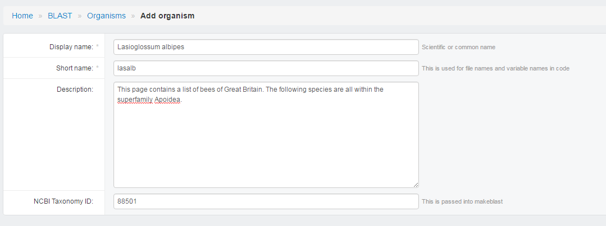
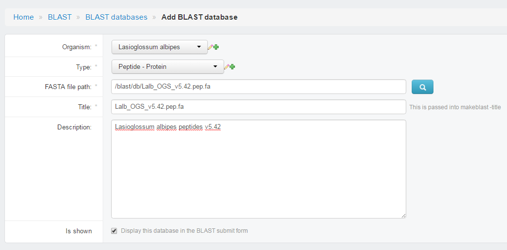
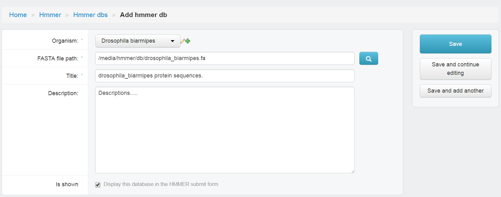

Workplace Apps
==============
Blast
-----
Introduction

I5K BLAST Tutorial is on https://i5k.nal.usda.gov/content/blast-tutorial

Install & Configuration
~~~~~~~~~~~~~~~~~~~~~~~
Install `BLAST <http://blast.ncbi.nlm.nih.gov/Blast.cgi>`_ and append Blast_bin directory in environment variable ``PATH``.

BLAST DB Configuration
~~~~~~~~~~~~~~~~~~~~~~
There are five tables for creating BLAST DB and browsing in I5K-blast.

* Add Organism:

  * Display name should be scientific name.
  * Short name are used by system as a abbreviation.
  * Descriptions and NCBI taxa ID are automatically filled. 

* Add Sequence types: 

  * Used to classify BLAST DBs in distinct catagories.
  * Provide two kinds of molecule type for choosing, Nucleotide/Peptide.

* Add Sequence
* Add BLAST DB

  * Choose ``Organsim``
  * Choose ``Type`` (Sequence type)
  * Type location of fasta file in ``FASTA file path``
  * Type ``Title`` name. (showed in HMMER page)
  * Type ``Descriptions``.
  * Check ``is shown``, if not check, this database would show in HMMER page.
  * Save 

* Add JBrowse settings

Hmmer
-----
HMMER is used for searching sequence databases for homologs of protein sequences, and for making protein sequence alignments. It implements methods using probabilistic models called profile hidden Markov models (profile HMMs).

I5K HMMER Tutorial is on https://i5k.nal.usda.gov/webapp/hmmer/manual.

Install & Configuration
~~~~~~~~~~~~~~~~~~~~~~~
Install `HMMER <http://hmmer.org/>`_ and append HMMER_bin directory in evironment varialbe ``PATH``.

HMMER DB Configuration
~~~~~~~~~~~~~~~~~~~~~~
Like Blast, HMMER databases must be configured then they could be searched. 

Go django admin page and click Hmmer on left-menubar. You need to create HMMER db instance (Hmmer dbs) for each fasta file.

* Choose ``Organsim``
* Type location of peptide fasta file in ``FASTA file path``
* Type ``Title`` name. (showed in HMMER page)
* Type ``Descriptions``.
* Check ``is shown``, if not check, this database would show in HMMER page.
* Save 

HMMER Query Histroy
~~~~~~~~~~~~~~~~~~~
HMMER query histories are stored in table ``HMMER results``. Users could review them on dashboard.
All query results (files on disk) will be removed if it's expired. (default: after seven days)

Query results locate in directory ``$MEDIA_ROOT/hmmer/task/``.

Clustal
-------
ClustalW is the oldest of the currently most widely used programs for multiple sequence alignment. Clustal Omega is the latest version of CLUSTAL series. ClustalO is faster and more accurate because of new HMM alignment engine.

I5K CLUSTAL Tutorial is on https://i5k.nal.usda.gov/webapp/clustal/manual.

Install & Configuration
~~~~~~~~~~~~~~~~~~~~~~~
Install `Clustalw <http://www.clustal.org/clustal2/>`_ and `Clustal Omega <http://www.clustal.org/omega/>`_.
Then append both bin directory in evironment varialbe ``PATH``.

Clustal Query Histroy
~~~~~~~~~~~~~~~~~~~~~
Clustal query histories are stored in table ``Clustal results``. Users could review them on dashboard.
All query results (files on disk) will be removed if it's expired. (default: after seven days)

Query results locate in directory ``$MEDIA_ROOT/clustal/task/``.

Dashboard
---------

Personal query history.

Data
----
Rest framework. Not finished

Proxy
-----

For providing indirect access to some resources without https. Currently it is used by Web Apollo instances for looking up GO Terms.

Drupal_SSO
----------

Coonection to Drupal summit data function.

::

    DRUPAL_URL = 'https://gmod-dev.nal.usda.gov'

    # cookie can be seen in same domain
    DRUPAL_COOKIE_DOMAIN=".nal.usda.gov"

WebApollo SSO
-------------
Complete introduction locate in Section 4. 
