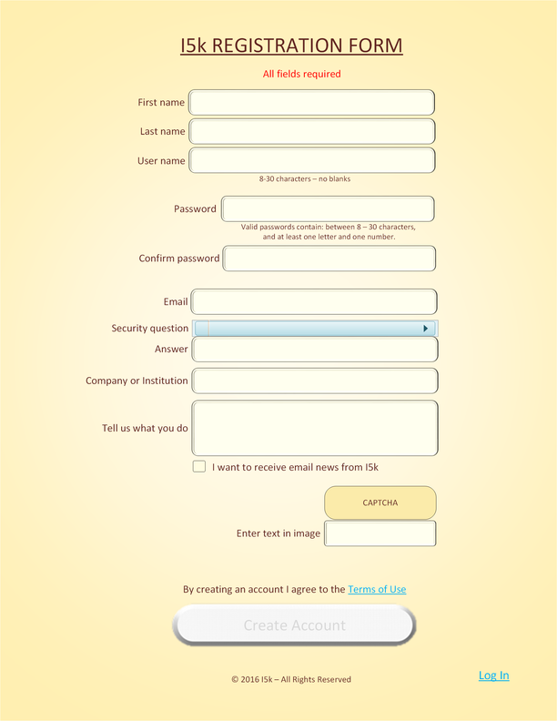
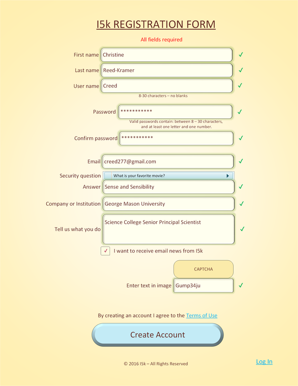
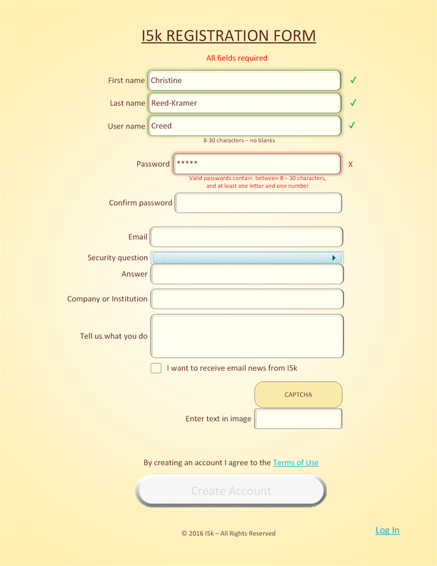
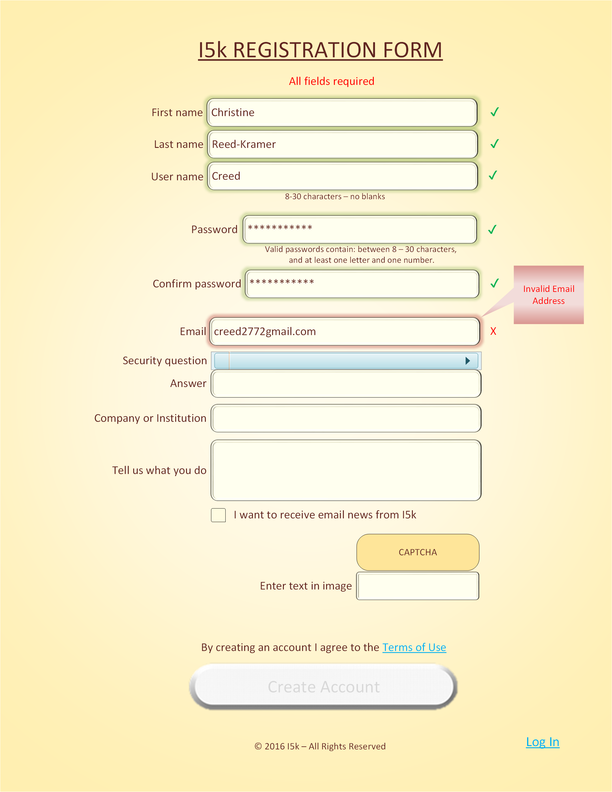
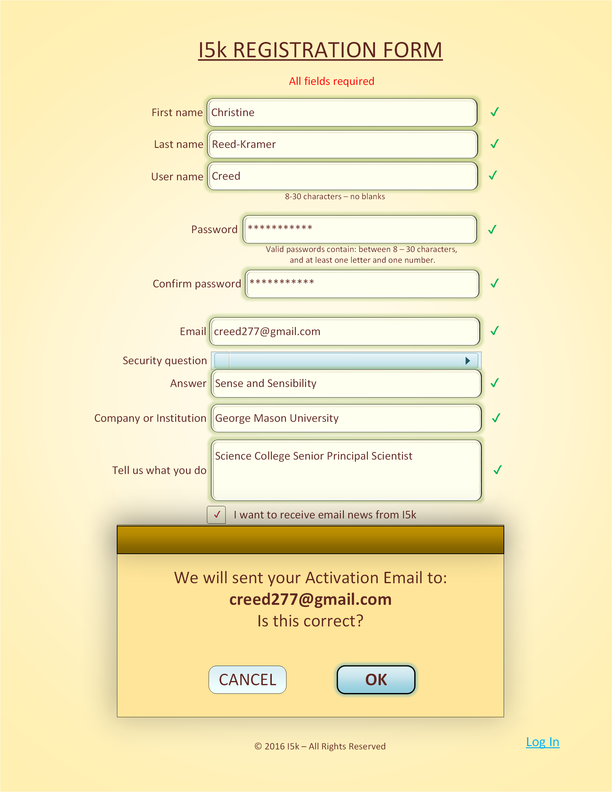

# DASHBOARD DESIGN

The Dashboard is the user cockpit and traffic hub in the I5k experience. It caters for both guest visitors and registered users.  

The Dashboard is both a Web page and a programming construct acting as gateway to content, applications, and features.

The Dashboard modifies the Home Page according to user action. Consequently, " > Dashboard " never appears in the breadcrumbs path. It has no public URL.  

Joseph Suriol - July 2016 - jsuriol@tiglath.net

## Table of Contents

- [Terminology](#Terminology)
- [High Level Design](#HighLevel)
- [Access](#Access)
- [Guest Dashboard](#GuestDashboard)
- [User Dashboard](#UserDashboard)
- [Registration](#Registration)
- [Login](#Login)
- [Applications](#Applications)
- [Application Access](#ApplicationAccess)
- [Logout](#Logout)
- [Programming Structure](#ProgrammingStructure)
- [Dashboard/Application API](#DashAppAPI)
- [Testing](#Testing)

## Terminology 

- **Guest**: A site visitor&mdash;anyone in the world&mdash;with limited, read-only access to content and features. 
- **User**: A site visitor who has completed the registration process and for whom there exists a user id, password and email address, and optionally other data. 
- **Property**: An attribute linked to a *User*, like his password, email address, access privileges, or other user-specific data. 
- **User Id**: A unique alpha-numeric string that identifies a user within the site and satellite applications.
- **Password**: A secret string that conforms to the site password rules, which the site authentication subsystem stores as a hashed digest.
- **Email**: A *User*'s email address&mdash;a required *Property*&mdash;used in all *User* communications with the site administrators and others.  
- **Registration**: The process to become a *User*. It entails supplying *User Id*, *Password*, and *Email*. 
- **Preferences**: Additional data linked to a *User*, apart from his *User Id*, *Password* and *Email*, which results in a set of *Properties* for the *User*.
- **Creds**: A *User*'s credentials, i.e., their *User Id* and *Password* stored in the site authentication subsystem.
- **Privs**: The set of a *User*'s access-granting privileges, which determined the navigational elements the dashboard presents to the *User*.
- **Role**: The function assumed by a person within the site, implicitly inferred from their *Privs* and other *Properties*, but not a *Property* in itself. 
- **History**: A retrievable record of a *User*'s activity in the site, which the *User* can optionally edit and replay. 
- **Project**: A discrete content unit managed by one *User*. For example, a particular insect's genome map. 
- **Coordinator** A *User* who manages one or more *Projects*. 
- **App**: Any autonomous application connected to the dashboard to provide access to *Guests* and *Users* to its content and features. 
- **Home Page**: A sparse initial Web page to welcome *Guests* and *Users*. 
- **Dashboard**: A modified *Home Page* presenting top-level content navigation to *Guests* and *Users*.
- **Guest Dashboard**: Or Guest Page. The page offering top-level content and features to *Guests*.
- **User Dashboard**: Or User Page. The home page for *Users* after they log in, renamed as the *User*'s Page.

This document propercases (first letter capitalized) each occurrence of these terms to indicate they allude to these definitions. 

## High Level Design  

- TBD

## Access  

Guests and Users access the Dashboard transparently and initially by the Home Page, and then by any link to the Guest home or User home. 

### Home Page Access

In this Home Page example the Guest Dashboard would appear after clicking the "Explore I5k" blue button. 

---

---

### Link Access

- TBD

## Guest Dashboard 

- TBD

## User Dashboard 

After the User logs in the Home Page turns into the User Dashboard, customized with the User's content and with navigation and features according 
to the User's Properties. For example:

---

---
  
## Registration 

Guests access the registration form from the *Register/Login* link in the top bar of the Home Page which is a persistent navigation element, found
in most pages. 

The Registration form contains the following text input fields: 

+ Fist Name
+ Last name 
+ User name 
+ Email address
+ Password 
+ Confirm Password
+ Security question - Dropdown question selector widget.
+ Security Answer
+ Company or Institution 
+ Tell us what you do - Multiline field
+ Captcha compliant to USDA guidelines

All above fields required. 

Additionally: 

+ A check box for "I would like to receive email news from I5k."
+ A 'Terms of Use' link inside the phrase "By creating an account you agree to the Terms of Use." 
+ "Create account" submit button.  
+ A 'Log in' link to the login page.  
+ A '© 2016 I5k - All Rights Reserved' foot notice.  

For example:
---

---

Upon loading the Registration form keyboard focus and cursor moves to the *First name* field. 

### Form Validation 

The Registration form validates each field on the spot (as each character arrives and on focus out event) 
and submits registration data to the dashboard after validation passes and the *Create Account* button activates.  

The *Create Account* button does not become enabled until validation passes. Until then, it should appear greyed-out. 

For each field, when validation passes a green check mark appears to the right of the field 
and a green glow frames the entire field.

Example of validated Registration form:
---

---

When validation fails a red 'x' mark appears to the right of the field 
and a red glow surrounds the entire field. If the field has help text the help text turns red.

Example of invalid field with help text:
---

---

If the field has no help text, a callout appears with the appropriate caution. 

Example of invalid field without help text:
---

---

After the Guest clicks *Create Account* an email confirmation dialog appears. If the Guest clicks *OK* registration proceeds, if *CANCEL*
the Guest can edit the email entry and try again. 

Example of Email Confirmation:
---

---

Field Validation:

Single-line fields accept no newline characters. All fields are single-line except 
'*Tell us what you do*' which accepts more than one line. 

+ *First* and *Last Name* - Allow only alphabetical and special characters found in names. The following regular expression 
allows for English and Englified names '/^[a-z ,.'-]+$/i', but not for international characters like Hungarian, Polish, accented letters, etc.
+ *User name* - Allow only 8-30 printing characters, no blanks. 
+ *Password* - Allow only 8-30 printing characters with at least one letter and one number. 
+ *Confirm Password* - Must match a valid *Password*.
+ *Security Answer* - Allow only up to 100 printing characters. 
+ *Company or Institution* - Allow only up to 100 printing characters. 
+ *Tell us what you do* - Allow a tweet - up to 140 printing characters. 

Registration form data constitutes a *Registration Record*, which the Registration page sends to the Dashboard for storage, with the API function
*Store_Registration*. Upon successful storage in the Dashboard, the Registration page replaces itself with a bare page informing the Guest of 
the *Account Activation Email* they will receive soon, and showing the destination email (from the form), with instructions to click the 
*Account Activation Link* in the email to complete the registration.

If at that point the Guest discovers that the destination email is incorrect, they must restart the registration process. The stored Registration
Record will expired and become garbage.  

This page includes a *Close* button which when clicked returns the Guest to the Home Page.  

The *Store_Registration* function stores the *Registration Record* and sends an *Account Activation Email* to the Guest, 
expecting the Guest to click the *Account Activation Link* it contains. 

The *Account Activation Link* triggers a call to the Dashboard API funtion *Activate_Registration*, which creates a new User, the User's Properties, 
and registers the new User with the Authentication Subsystem by sending the User's Creds to CAS.  

Prior to Account Activation, the Registration Record remains in the Dashboard and has an expiry date of one month, which once elapses, 
absent activation, triggers the deletion of the Registration Record. 

### Registration Steps 

1. For each input field validate input until all fields pass validation. Keep *Create Account* button disabled.
2. Validation completes -> Enable *Create Account* button.
3. User clicks *Create Account* button -> Confirm email address is correct. If not correct goto #1 
4. Call *Store_Registration* Dashboard API function to store form data in the Dashboard. 
5. Inform Guest to expect *Account Activation Email* -> The dashboard sends *Account Activation Email* to Guest.
6. Guest receives *Account Activation Email* and clicks *Account Activation link* in email. 
7. *Account Activation Link* triggers *Activate_Registration* Dashboard API function.  
8. Dashboard creates new User, User Properties, and registers User's Creds with CAS. 
9. Dashboard present new User with the login page. 

### Registration Record

The Registration form sends the *Registration Record* to the Dashboard in JSON format, as follows: 

    { 
        "registration": {
            "creation_date: "<date and time>",
            "names": {
                "first_name": "<first name>",
                "last_name": "<last name>",
            },
            "security": {
                "creds": {
                    "user_name": "<user name>",
                    "password": "<password cleartext>",
                }, 
                "security_question": "<question number>",
                "security_answser": "<answer>",
                "address": "<user IP address>",
            },
            "email": "<email address>", 
            "affiliation": "<Company or Institution>",
            "about_user": "<Tell us what you do>",
            "email_subscribe": "<True or False>",
        }
    }
    

### CAS Registration

- TBD 

## Login 

- TBD

### Login Steps

- TBD

### Login Page

- TBD

### Password Requirements

- TBD

## Applications  

- TBD

## Application Access 

- TBD

## Logout 

- TBD

---

## Programming Structure 

- TBD

### Authentication Subsystem

The Authentication Subsystem provides the functionality for users to login and logout, and for the registration process to add new users and their 
credentials to the site.  

#### Single Sign-On

The Central Authentication Service (CAS) provides a single sign-on protocol for the Web to permit a User to access 
multiple applications while providing their Creds only once. It also allows applications to authenticate Users without gaining access to the
Users' Creds. Apps relinquish the login operation to the Dashboard, and assume Users reaching the App as already authenticated.   

The Authentication Subsystem keeps User Creds securely and centrally in a MySql database at the sole service of the CAS Server. The Login Handshake 
Flow diagram shows the interactions between the browser (User), the Dashboard, and the CAS Server. 

---

---

- TBD

#### Single Logout 

-TBD 

## Dashboard/Application API 

- TBD

### Application Access Handshake

- TBD
## Testing 

- TBD
