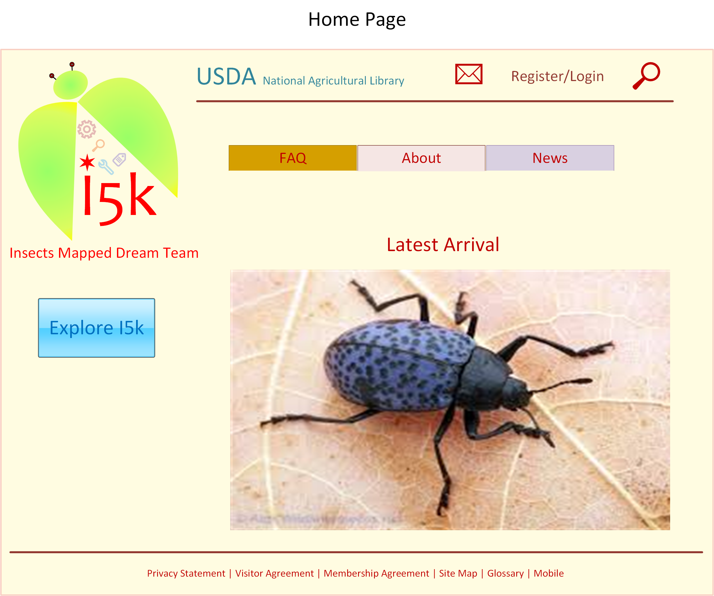
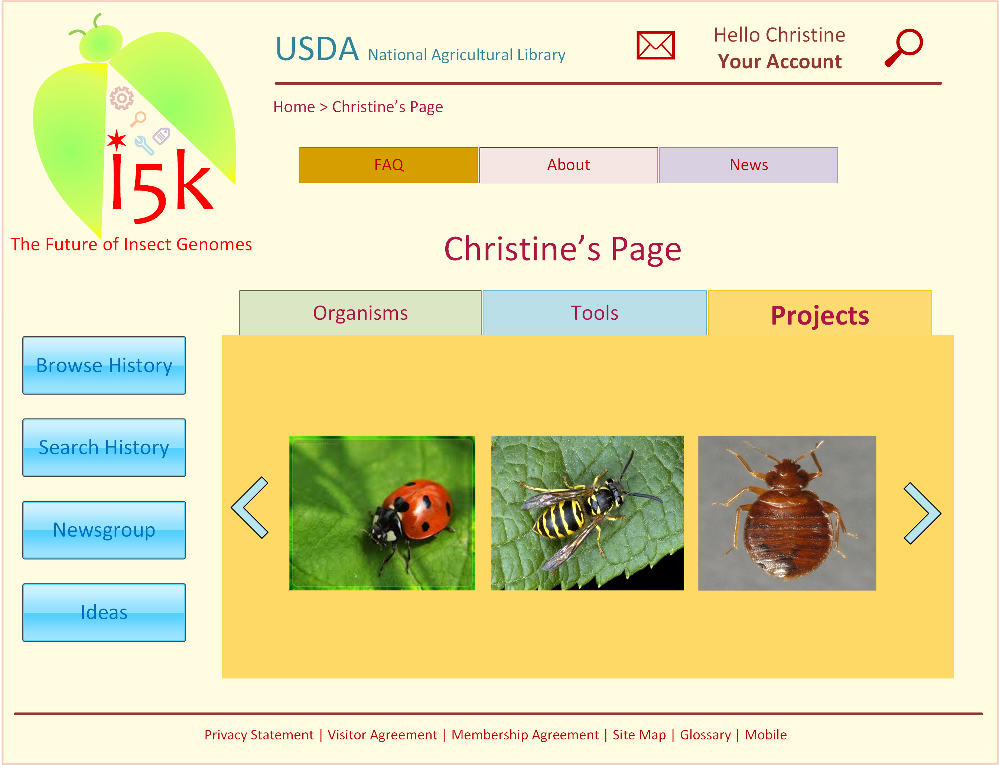
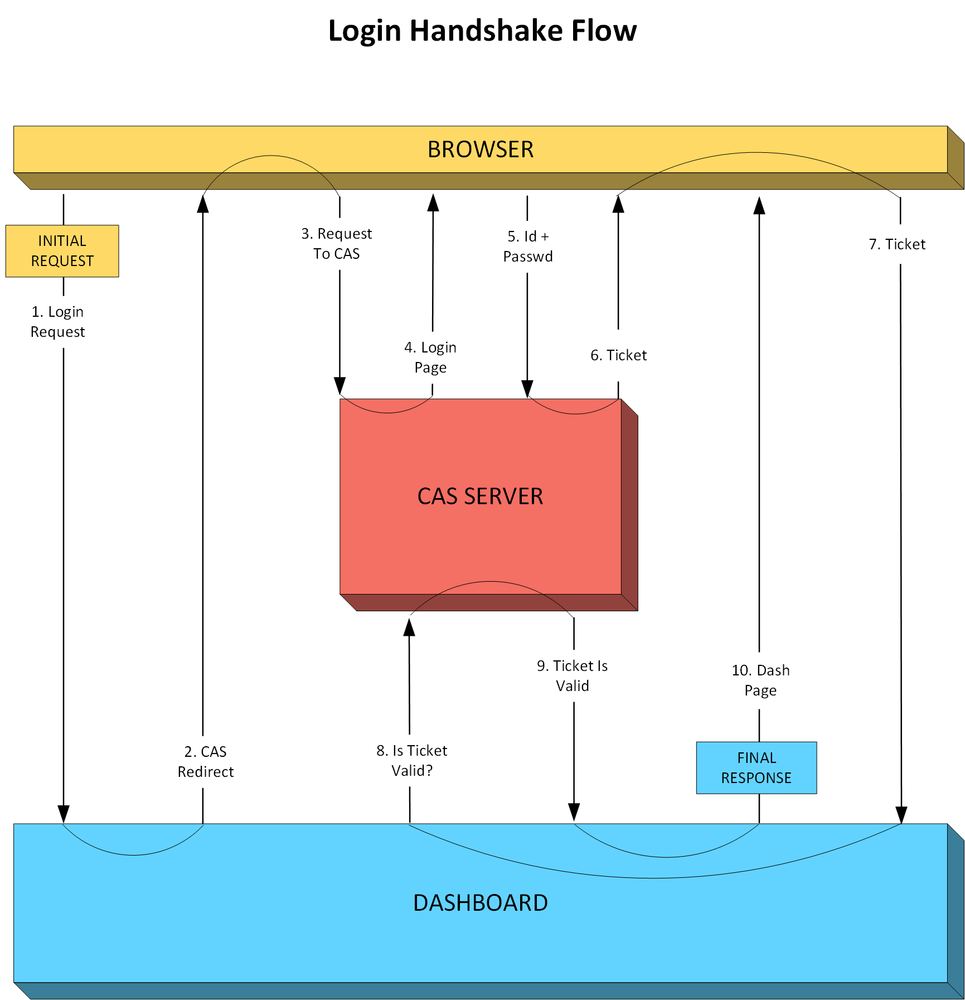

# DASHBOARD DESIGN

The Dashboard is the user cockpit and traffic hub in the I5k experience. It caters for both guest visitors and registered users.  

The Dashboard is both a Web page and a programming construct acting as gateway to content, applications, and features.

The Dashboard modifies the Home Page according to user action. Consequently, " > Dashboard " never appears in the breadcrumbs path. It has no public URL.  

Joseph Suriol - July 2016 - jsuriol@tiglath.net

## Table of Contents

- [Terminology](#Terminology)
- [High Level Design](#HighLevel)
- [Access](#Access)
- [Guest Dashboard](#GuestDashboard)
- [User Dashboard](#UserDashboard)
- [Registration](#Registration)
- [Login](#Login)
- [Applications](#Applications)
- [Application Access](#ApplicationAccess)
- [Logout](#Logout)
- [Programming Structure](#ProgrammingStructure)
- [Dashboard/Application API](#DashAppAPI)
- [Testing](#Testing)

## Terminology 

- **Guest**: A site visitor&mdash;anyone in the world&mdash;with limited, read-only access to content and features. 
- **User**: A site visitor who has completed the registration process and for whom there exists a user id, password and email address, and optionally other data. 
- **Property**: An attribute linked to a *User*, like his password, email address, access privileges, or other user-specific data. 
- **User Id**: A unique alpha-numeric string that identifies a user within the site and satellite applications.
- **Password**: A secret string that conforms to the site password rules, which the site authentication subsystem stores as a hashed digest.
- **Email**: A *User*'s email address&mdash;a required *Property*&mdash;used in all *User* communications with the site administrators and others.  
- **Registration**: The process to become a *User*. It entails supplying *User Id*, *Password*, and *Email*. 
- **Preferences**: Additional data linked to a *User*, apart from his *User Id*, *Password* and *Email*, which results in a set of *Properties* for the *User*.
- **Creds**: A *User*'s credentials, i.e., their *User Id* and *Password* stored in the site authentication subsystem.
- **Privs**: The set of a *User*'s access-granting privileges, which determined the navigational elements the dashboard presents to the *User*.
- **Role**: The function assumed by a person within the site, implicitly inferred from their *Privs* and other *Properties*, but not a *Property* in itself. 
- **History**: A retrievable record of a *User*'s activity in the site, which the *User* can optionally edit and replay. 
- **Project**: A discrete content unit managed by one *User*. For example, a particular insect's genome map. 
- **Coordinator** A *User* who manages one or more *Projects*. 
- **App**: Any autonomous application connected to the dashboard to provide access to *Guests* and *Users* to its content and features. 
- **Home Page**: A sparse initial Web page to welcome *Guests* and *Users*. 
- **Dashboard**: A modified *Home Page* presenting top-level content navigation to *Guests* and *Users*.
- **Guest Dashboard**: Or Guest Page. The page offering top-level content and features to *Guests*.
- **User Dashboard**: Or User Page. The home page for *Users* after they log in, renamed as the *User*'s Page.

This document propercases (first letter capitalized) each occurrence of these terms to indicate they allude to these definitions. 

## High Level Design  

- TBD

## Access  

Guests and Users access the Dashboard transparently and initially by the Home Page, and then by any link to the Guest home or User home. 

### Home Page Access

In this Home Page example the Guest Dashboard would appear after clicking the "Explore I5k" blue button. 

---

---

### Link Access

- TBD

## Guest Dashboard 

- TBD

## User Dashboard 

After the User logs in the Home Page turns into the User Dashboard, customized with the User's content and with navigation and features according 
to the User's Properties. For example:

---

---
  
## Registration 

- TBD

### Registration Steps

- TBD

### Registration Page

- TBD

## Login 

- TBD

### Login Steps

- TBD

### Login Page

- TBD

### Password Requirements

- TBD

## Applications  

- TBD

## Application Access 

- TBD

## Logout 

- TBD

---

## Programming Structure 

- TBD

### Authentication Subsystem

The Authentication Subsystem provides the functionality for users to login and logout, and for the registration process to add new users and their 
credentials to the site.  

#### Single Sign-On

The Central Authentication Service (CAS) provides a single sign-on protocol for the Web to permit a User to access 
multiple applications while providing their Creds only once. It also allows applications to authenticate Users without gaining access to the
Users' Creds. Apps relinquish the login operation to the Dashboard, and assume Users reaching the App as already authenticated.   

The Authentication Subsystem keeps User Creds securely and centrally in a MySql database at the sole service of the CAS Server. The Login Handshake 
Flow diagram shows the interactions between the browser (User), the Dashboard, and the CAS Server. 

---

---

- TBD

#### Single Logout 

-TBD 

## Dashboard/Application API 

- TBD

### Application Access Handshake

- TBD
## Testing 

- TBD
