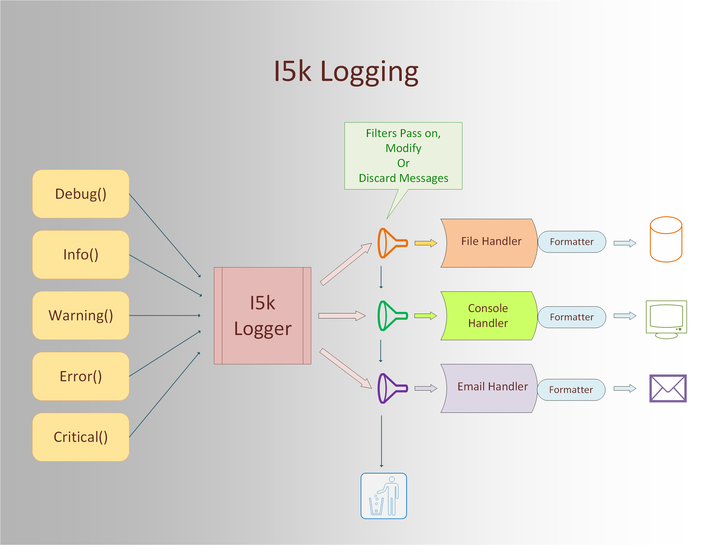

# I5K LOGGING  

Short guide to I5K logging.  

  -  J. Suriol September, 2016

## Table of Contents

- [I5k Logging](#I5kLogging)
- [Configuration](#Configuration)
- [Making Configuration Changes](#ConfigChanges)
- [Creating Log messages](#CreatingLogs)

## I5k Logging 

The I5k project uses Django logging, which is based on the Python logging subsystem.  
In addition to using the default Django loggers, it creates a new single logger named 'i5k' 
for project-wide use. 

Explicit function calls with string messages as arguments inserted into the Python 
code, constitute the logging input.  

For example: 

    dash.error("Method not supported")  

Logging output has various destinations according to the severity of the log and the configuration 
settings, including files, the console, and email. 

A main attribute of a log entry is its severity level. This system supports five severity levels:

    DEBUG     - That
    INFO      - To support counters and statistics.
    WARNING   - Something is slightly wrong.
    ERROR     - Error fatal to request or transaction, but the system continues functioning.
    CRITICAL  - Fatal system error, or an otherwise grave error occurred. 

The efficiency of the entire logging system relies in no small degree on the judicious use 
of severity levels when adding logging calls to the code.  

## Configuration 

In order to understand i5k/Django/Python logging one must become familiar with its
constituent parts: *loggers*, *handlers*, *filters*, and *formatters*. 

One way to do that is by reviewing the actual logging configuration, as specified
in the *settings.py* file 

The entire logging configuration fits into a dictionary 

The configuration dictionary showing first-level entries only looks like this: 

    LOGGING = {
        'version': 1,
        'disable_existing_loggers': False,
        'loggers':     {}
        'handlers':    {}
        'filters':     {}
        'formatters':  {}
    }

After the version, for which '1' is the only valid value at present, we specify 
to leave Django default loggers enabled.  
 
Log messages are submitted by functions, like debug(), info(), etc., to a logger. The logger in turn 
passes the message to one or more handlers, through any filters which may modify 
or suppress the message, finally handlers render the message according the the 
formatter attached to them and route it to the intended destination.

This diagram shows the operational role of each component:

The description of loggers, handlers filters and formatters is best done from 
the bottom up starting with formatters. 

### Formatters

Ultimately, a log record needs to be rendered as text. Formatters describe the exact 
format of that text. In our configuration we use only one formatter named 'normal' 
to produce a standardized log message amenable to reliable text manipulation 
by the various tools that can be used to examine and analyze log files. 

    'formatters': {
        'normal': {
            'format': '%(name)s %(levelname)s %(asctime)s %(process)d [%(message)s]'
        },
    }

%(name)s is the logger's name, in our case either 'django.*' or 'i5k'.  

%(levelname)s is the severity. One of: DEBUG, INFO, WARNING, ERROR, or CRITICAL.

%(asctime)s is the date and time the log is submitted.  

%(process)d is the process id (PID) of the process submitting the log. 

[%(message)s] is the log message, enclosed in square brackets.  

Thus, an example log message looks like: 

    django.request WARNING 2016-09-08 05:31:01,681 4678 [Not Found: /dashboard]

We have no control of the message part of the logs produced by the Django loggers, 
but we can still specify their general log entry format.

### Filters

Filters can be used by handlers and loggers for more sophisticated filtering than is provided by severity levels.
In our configuration we define only simple filters for handlers.  

    'filters': {
        'require_debug_false': {
            '()': 'django.utils.log.RequireDebugFalse'
        },
       'require_debug_true': {
            '()': 'django.utils.log.RequireDebugTrue',
       },
    }

The filter *'require_debug_false'* allows logs into its handler only if DEBUG == False in 
the *settings.py* file.  
 
Conversely, the  filter *'require_debug_true'* allows logs into its handler only if DEBUG == True in 
the *settings.py* file.  

### Handlers

Handlers determine the destination of a log message, either to the screen (console), to 
a file, to email, or to a network socket. 

Our configuration defines four handlers:

One to send email to the admins, two rotating file handlers, and a console handler. 

    'handlers': {
        'mail_admins': {
            'level': os.getenv('ADMIN_LOG_LEVEL', 'ERROR'),
            'filters': ['require_debug_false'],
            'class': 'django.utils.log.AdminEmailHandler',
            'formatter': 'normal'
        },
        'django_file': {
            'class': 'logging.handlers.TimedRotatingFileHandler',
            'filename': '/var/log/django/django.log',
            'when': 'midnight',
            'backupCount': 60,
            'formatter': 'normal'
        },
        'i5k_file': {
            'class': 'logging.handlers.TimedRotatingFileHandler',
            'filename': '/var/log/i5k/i5k.log',
            'when': 'midnight',
            'backupCount': 60,
            'formatter': 'normal'
        },
        'console': {
            'class': 'logging.StreamHandler',
            'filters': ['require_debug_true'],
            'formatter': 'normal'
        },

Handlers can filter messages based on severity level or with one or more specialized filters.  

The *'mail_admins'* handler sends logs of ERROR or CRITICAL severity only to the admins, by default, 
or of the severity specified in the environment variable ADMIN_LOG_LEVEL if set, or higher. The handler 
filter suppresses emailing logs to the admins if running in debug mode. 

The *'django_file'* handler sends logs to the '/var/log/django/django.log' file. 
The *'i5k_file'* handler sends logs to the '/var/log/i5k/i5k.log' file. 
Both handlers rotate the log file at midnight and keep up to 60 log files, deleting the 
oldest files as new ones get created.  

The *'console'* log handler send logs to the screen, and its filter suppresses all logs 
if NOT running in debug mode, because console logs are most useful during development.  

### Loggers

A *logger* is a Python object that instantiates the logger class whose methods we call
to create log entries.  For example, 

    import logging
    dash = logging.getLogger('i5k')
    dash.info("User creed logged in")  

creates logger 'i5k' and returns a pointer to in in the variable 'dash' 

If the logger already exists, it just returns a pointer to it that can be used
in a module, so 'getLogger is safe to call as many times as necessary.  

We configure a new logger, 'i5k', and re-configure 'django' default logger with 
new handlers.  

    'loggers': {
        'django': {
            'handlers': ['mail_admins', 'django_file', 'console'],
            'level': os.getenv('DJANGO_LOG_LEVEL', 'INFO'),
            'propagate': True,
        },
        'i5k': {
            'handlers': ['mail_admins', 'i5k_file', 'console'],
            'level': os.getenv('I5K_LOG_LEVEL', 'INFO'),
            'propagate': True,
        },
    }

Django comes with the following default loggers: 

    django
    django.request
    django.db.backends
    django.db.backends.schema
    django.security.*  # include various sub-loggers

The Django loggers are arranged in a tree hierarchy with 'django' being the root 
logger. When 'propagate' is True logs submitted to sub-loggers are passed up to the 
parent logger all the way up to the root.  

Therefore 'django' is a catch-all logger and its handlers will route logs from 
all its sub-loggers. 

The 'level' attribute sets the logging threshold. That is the logger will log only 
messages of a severity equal to or greater than 'level'.  

Here 'level' comes from an environment variable, and if the variable is not set, 
the threshold is set at INFO severity. 

The 'i5k' project logger has no sub-loggers, but if any were added it would also act 
as catch-all for the entire hierarchy because 'propagate' is True.  

## Making Configuration Changes 

It would be convenient to have an admin tool to change the application 
settings dynamically as the system is running.  Settings, however, are 
immutable for a number of good reasons. 

From Django 1.8 docs:

    "You shouldn’t alter settings in your applications at runtime."

Changes to the logging configuration usually involve modifying the LOGGING dictionary in the
settings.py file, but a few settings can be tweaked by changing the values of certain
enviromental variables. 

Either way, for changes to take effect it requires a Django server restart. 

These variables can alter the logging behavior: 

    Variable name       Default 
    ---------------------------
    ADMIN_LOG_LEVEL      ERROR
    DJANGO_LOG_LEVEL     INFO  
    I5K_LOG_LEVEL        INFO

ADMIN_LOG_LEVEL determines the threshold for sending logs to the admins by email.  

DJANGO_LOG_LEVEL determines the messages the 'django' logger logs, by severity. It does 
not log messages of severity lower than DJANGO_LOG_LEVEL or INFO if the variable is not set. 

I5K_LOG_LEVEL determines the messages the 'i5k' logger logs, by severity. It does 
not log messages of severity lower than I5K_LOG_LEVEL or INFO if the variable is not set. 

For example after this:  

    - stop Django
    - export I5K_LOG_LEVEL=DEBUG
    - start Django

the i5k logger will start logging messages of all severities.  

## Creating Log Messages 

Developers can use the 'i5k' logger for all logging purposes, project-wide.  
The 'django' logger is best kept for Django's exclusive use. 

To log messages with the 'i5k' logger include these two modules in your program file, 
and if possible adhere to the following conventions.  

    import misc.fileline as src 
    from misc.logger import i5kLogger

The *fileline* module provides functions to include the file name and the line number 
of the call to the logger in the log message, similar to the \_\_FILE\_\_ and \_\_LINE\_\_
macros in the C language.  

The *i5kLogger()* function is a wrapper for:

    return logging.getLogger('i5k')

Here is an example showing the use of all logging methods.  

    
    import misc.fileline as src 
    from misc.logger import i5kLogger

    blast = i5kLogger() 

    blast.debug("<debug message> (file: %s line: %s)" % (src.file(), src.line()))

    blast.info("<info message> (file: %s line: %s)" % (src.file(), src.line()))

    blast.warning("<warning message> (file: %s line: %s)" % (src.file(), src.line()))

    blast.error("<error message> (file: %s line: %s)" % (src.file(), src.line()))

    blast.critical("<critical message> (file: %s line: %s)" % (src.file(), src.line()))

'blast', or any variable name of your choice, holds the pointer to the 'i5k' logger, and 
allows to call any of the five methods corresponding to the five message severities.  

The resulting debug log is for example:

    i5k DEBUG 2016-09-08 10:29:22,861 9055 [<debug message> (file: /django-blast/blast/views.py line: 23)]

Log entries are usually a single line, except when you print the http request, if available.  

To add the entire http request to the log message use the *request()* funtion of the *fileline* module. 

In a view or any other function where the request is available, say in the variable 'request', you can 
add the request to the log like this:

    blast.error("<error message> (file: %s line: %s) %s" % (src.file(), src.line(), src.request(request)))

This produces a multiline log similar to this: 

    i5k ERROR 2016-09-08 05:31:01,484 4678 [<error message> (file: /django-blast/blast/views.py line: 29)
    request:
    <WSGIRequest
    path:/dashboard,
    GET:<QueryDict: {}>,
    POST:<QueryDict: {}>,
    COOKIES:{'csrftoken': 'lw03D5JjghuOzEFDsQE3uaREaHr1xUM2'},
    <other request fields> 

The request data makes the log file less readable but equally useful to text manipulation tools.
The call to *'src.request(request)'* returns the string 'request:' in the first line, so there is no need to 
add it to the message format string. 

Adding the file and line to each logging call is a bit laborious, but it provides invaluable information 
to troubleshooters and developers when errors occur, and it is a recommended practice that repays the time invested many times over.
