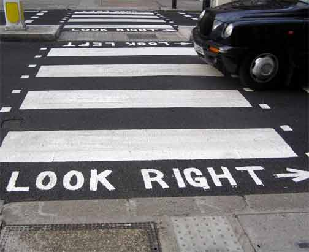

# USABILITY  

A list of key points on usability from several references, mostly notes from a corporate course attended years ago. 

This may help craft a usability standard for our dashboard/website, and help with decisions involving layout, navigation, look and feel. 

Please feel free to *critique it* so I can amend it and we can share a common set of guidelines. 

Joseph Suriol - July 2016 - jsuriol@tiglath.net

## Table of Contents

- [Basic Concepts](#BasicConcepts)
- [The Average User](#AverageUser)
- [Creating a Visual Hierarchy](#VisualHierarchy)
- [Clicking](#Clicking)
- [Navigation](#Navigation)
- [Home Page](#HomePage)
- [Usability Testing](#Testing)
- [The Mobile Platform](#Mobile)
- [User Goodwill](#Goodwill)
- [Accesibility](#Access)
- [Making Usability Happen](#MakeHappen)
- [It Depends](#ItDepends)

## Basic Concepts 

- Usability is common sense, so much of what follows may well sound obvious. 

- First Law of Usability (and the Average User's motto): 

  ***DON'T MAKE ME THINK.***

  Make things self-evident; obvious enough that your next door neighbor who has no interest in the subject can look 
  at a page and say, "That's a ____".  

  What makes us think? 

  + Clever names.
  + Marketing-induced names.
  + Company-specific names.
  + Unfamiliar technical names.

  For example a button with:
  
  + "Jobs" (obvious).
  + "Employment Opportunities" (milliseconds of thought).
  + "Job-o-Rama" (requires thought).

  A user should never have to devote a millisecond of thought to whether things are clickable&mdash;or not. 

  The appearance of things (like size, color, and layout), their well-chosen names, and the small amount of carefully crafted text should all work together to create a sense of nearly effortless understanding. 

  Making every page or screen self-evident is like having good lighting in a store. 

- Second Law of Usability:

  ***It doesn't matter how many times I have to click as long as each click is a mindless, unambiguous choice.***

- Third Law of Usability: 

  ***Omit ~~Needless~~ Words.***

  Get rid of half the words in a page, and then get rid of half of what's left. Be ruthless.  

- Engineers, including Web developers, want to innovate. Nobody gets awards for following 
  conventions. However, refrain!  

  ***Follow well-established conventions.***

- Happy talk must die. Happy talk (you know... "Welcome to..." and a voice inside goes "blah, blal, blah).  

- Instructions  must die. Users don't read, they muddle through. 

- Must get right: Navigation and Home Page.

- There is always a plausible rationale and good intentions behind every usability flaw. 

## The Average User  

Even if the actual audience is composed of highly educated people, it pays to assume that 
the audience is the Average User. 

The actual Average User is kept in a sealed vault at the International Bureau of Standards in Geneva. 

It's a person of average intelligence, or even a tad below.  

When we create a site we act as though people are going to pore over each page, weighing their options before they decide which link to click. What they actually do most of the time is glance at each new page, scan some of the text, and click the first link that catches their interest or vaguely resembles what they are looking for. 

Average Users don't read, they scan.  

Why do we scan?

- We are on a mission.
- We know we don't need to read everything.
- We are good at it. 

We don't make optimal choices.  We "satisfice" (from satisfy and suffice).

Average Users don't look for correct choices, they muddle through (*let's make muddling easy*).

A bit like the dog-owner admonishing Spot to leave the garbage can alone (the dog only hears: blah, blah, Spot, blah, blah, Spot, blah, blah), the Web developer sees in his Web pages good literature or product brochure, The Average User sees billboards at 60 mph. (*let's give them billboards*).  

In a small mobile screen, it's 80 mph.   

Average User gets it, life is good.  

From here on I will call the Average User simply, 'user' or 'users.'

## Creating a Visual Hierarchy 

- Keep visual noise down: too many elements clamoring for attention, bright colors, exclamation points, animation, etc.
- Disorganization.  Does your page look like a ransacked room?  
- Clutter.  Think Google.
- Format text for easy scanning.
- Use plenty of headings and put time into writing them.
- No floating headers (keep headers closer to the following text than the preceding text) and if using header levels make them easy to distinguish.
- Keep paragraphs short.
- Anything that can be put into a bullet list, probably should be (with extra space between items).  
- Don't highlight too many things, but highlight key words and phrases.

## Clicking 

***Make clickables obvious and consistent, same color or shape.***

Indicators of what is clickable (signifiers) are of prime importance.

How many clicks to a page seems like a useful metric, but in fact 
what matters more is how hard each click is: the amount of thought required 
and the amount of uncertainty about whether I am making the right choice.  

Rule of thumb:

***Three mindless unambiguous clicks equal one click that requires thought.***

- After clicking...  "Am I in the right place?"  

- Don't present all clickable options at once if each requires more than just a click. 

- When there is a complicated decision provide unavoidable help in the right place and the right time

London streets provide a good example of good help (for tourists unfamiliar with British quirks):

Brief, timely, unavoidable:

  
## Navigation 

*And you may find yourself in a beautiful house, with a beautiful wife... and you may ask yourself, How did I get here?*  

- Cater for two kinds of users, search-dominant, and link-dominant.

- At Sears, search-dominant ask the first clerk they see... "Where are the power tools?" Link-dominant look at the signs above the isles.  

- According to their frame of mind or level of urgency users will look for a search box or will click on a section. 

- Unlike traveling physical spaces, in a Web site it's hard to accumulate a sense of orientation. 

- The Home Page is like the North Star.  Being able to get back to it gives you a fresh start.  

- The obvious goal of navigation is to find what we are looking for and tell us where we are.  Navigation can and should do more then making the hierarchy visible, it tells us what the site contains. Navigation reveals content. 

- Done correctly, navigation gives us implicitly all the instructions we need (which is good because users will ignore other instructions, anyway).

- Persistent Navigation says: "Navigation is over here, it may vary depending where you are but it will always be here and work he same way."  

- Navigation in every page (almost) gives confirmation that you are still in the same site, which is more important than one might think.  And you only have to figure out how it works once. 

- Navigation can be reduced or omitted in the presence of forms to fill in, like registration, feedback, profile preferences, etc., though, it is still useful to have a home link and a link to utilities to help fill the form.  

Persistent Navigation elements: 

- **Site Id logo** and tagline on every page (upper left corner), no exceptions. Users expect the Site Id logo to be a link to the home page. 
- **Sections** (content hierarchy top level: e.g., Home, Products, Support, About).
- **Utilities** (not part of content hierarchy: e.g., Sign in/Register, Account, Contact, Help). 
- **Search** (text box and button with 'Search' or magnifying glass).

Persistent Navigation Do's:

- Include navigation on pages at all levels, not only the first two or three levels.  
- Utilities slightly less prominent that Sections and only about 4 or 5 most often used.  Leftovers belong in the small text links of the footer.  
- Have sample pages for all navigation levels before any concerns about color scheme. 
- Every page needs a name, in the right place of the visual hierarchy. It should appear to be framing the content. The name must be prominent (size, color, typeface) as the heading for the page. The name must match the words clicked to get there.  If the link or button reads "Sushi Rolls" it should take me to a page named "Sushi Rolls."  It's a tacit contract with the visitor, and violations lead to loss of trust.  
- Have the equivalent of "You are here" in a national park, by highlighting (e.g., different color AND bold text) the current location in navigation bars, lists, or menus that appear on the page.  
- Don't make these indicators too subtle.  Subtlety is the mark of sophistication, but not in Web design; users in a hurry miss subtle indicators.  
- Use breadcrumbs, that is, show the the path from the home page to where you are and make it easy to move up to higher levels in the hierarchy.  They are self-explanatory and don't take much room. 

Breadcrumbs: 

 + Put them at the top.
 + Use '>' between the levels.
 + Boldface the last item (name of the current page). 

Tabs: One of the few physical metaphors that actually works in a user interface. 

 + They are self-evident.
 + Hard to miss.
 + Slick and efficient. 

Do them right:

The active tab must pop out at you. Give a different color or contrast and it has to physically connect with the space below.  

The Blindfold Test:

You are blindfolded and when you can see again you see a page anywhere in the site:

You should be able to answer these questions without hesitation: 

- What site is this? (Site Id).
- What page am I on? (Page name).
- What are the major sections of this site? (Sections).
- What are my options at this level? (Local navigation).
- How can I search?

How to do the test:

- Choose a page and print it. 
- Hold it at arms length so you can't really study it closely. 
- As quickly as possible, try to find and circle each of these items.

  + Site Id.
  + Page Name.
  + Sections. 
  + "You are here" indicator. 
  + Search.

Ask others to do other pages.  

## Home Page 

Home Page has to accommodate:

- Site identity and mission. 
- Site hierarchy (content: What can I find here? and features: What can I do here?). 
- Search.
- Teases (entice with hints of the good stuff inside).
- Feature promos (invite to explore additional sections or try new features).
- Timely content (frequently updated content. Signs of life).  
- Shortcuts (to most frequently requested pieces).
- Log in/Registration.
- Show me what I am looking for. 
- And what I am not looking for (but may be interested in).
- Show me where to start. 
- Establish credibility and trust (No second chance to make a good first impression). 

Constrain: Everybody wants a piece of it... like waterfront property.   

Beware of: Design by stakeholders - then your home page may well include:

- Letter from the president.
- Headquarters photo.
- Mission/Philosophy statement.
- Press releases.
- Virtual tour. 

Remember The Sixth Sense?  ("I see dead people...").

In some home pages:  "I see stakeholders..."  

Stakeholders need to be educated about the danger of overgrazing the home page and offered other methods of driving traffic. 

Beware of: Too Many Cooks - Everybody, even the CEO, has an opinion about it.  

One Size Fits All: The home page has to appeal to all who visit the site.

The home page can't do it all: It involves compromise.  

Don't lose this: Conveying the Big Picture (it has to make clear what the site is).

Needs to answer four questions: 

- What is this? 
- What do they have here? 
- What can I do here? 
- Why should I be here&mdash;and not somewhere else?  

At a glance, with little effort. 

Like the Big Bang, the first few seconds are critical.  

Not everybody enters the site through the home page. A user clicks a link in an email to a page deep in a site, and...  

...that is what persistent navigation is for.  They can always jump to the home page and get their bearings.

How to get the message across:

- The Tagline (visually connected to the Site Id - Nothing beats a good tagline [No one else in the world could use it but you]):
    + Zipcar - wheels when you need them.
    + Opentable - Restaurant Reservations * Free * Instant * Confirmed.
    + www.fueleconomy.gov - the official US government source for fuel economy information.
- The Welcome Blurb (No mission statement, but a terse, prominent description of the site that catches the eye).
- The "Learn more..." (when it requires a fair amount of explanation).

A tagline is not a motto ("To Protect and Serve" - a guiding principle) a tagline conveys a value proposition. Use as much space as necessary to get the message across. Fight excuses, like:

- I can't imagine that anybody doesn't know what this site is.
- Others clamor to use the home page for other purposes. 

But keep it SHORT.  

Additionally, a home page should say with confidence: 

- Here is where to start if I want to search. 
- Here is where to start if I want to browse.
- Here is where to start if I want to sample their best stuff. 

Home page design may involve religious debates where nobody is going to change their mind, and the perennial struggle between art and commerce (farmers and cowmen vs. the railroad barons?).  Endorphins are involved.  

Then arguments turns to, what "most users like," in the belief users are like *anything*. 

I must come clean: There is no Average User. 

All Web users are unique and all Web use is basically idiosyncratic.  

What works is good, integrated design that fills a need, carefully thought out, well executed and tested. 

Testing: it answers the important question of whether we created a good experience for most people who are likely to use *this* site. There is no substitute for it.    

## Usability Testing  

Usability tests are about watching one person at a time trying to use something to do typical tasks so you can detect and fix the things that confuse or frustrate them. 

That is, watch them use, not just listen to them talk.   

- If you want a great site you have to test, from the beginning. After working on the site for a few weeks you can't see it freshly anymore, you know too much. Watch other people try to use it. 
- Testing one user early in the project is better than testing 50 near the end. 

Tests can be elaborate and expensive in testing labs behind one-way mirrors followed by scientific and statistical reports one week later, or much simple in an inexpensive DIY fashion.  

One way is to do usability testing one morning a month. Two or three participants. Debrief over lunch and decide what to fix before the next round of testing.  

Agile teams test more often but what is important is to set a schedule and stick to it.  

**Why test one morning a month instead of scheduling tests around deliverables and  milestones?**  

- It keeps it simple so you'll keep doing it. 
- It gives you what you need. Watching three participants, you'll identify enough problems to keep you busy for a month. 
- Deliveries and milestones suffer from frequent slippage, and the tests slip with them.  
- It frees you from deciding when to test.  Pick a regular day, e.g., third Wednesday.  
- There will be always something you can test each month.  

The tests do not result in quantitative proofs, they are not rigorous at all.  You give them task to do, you observe, and you learn. The results are actionable insights.  

You are not going to find all the problems, but with three users you will likely find the most significant problems related to the tasks you give them. 

**Who do you choose as participants?**

It is good to do testing with participants who reflect the target audience, but it is not essential, especially if it entails more work or having to test less; almost anyone will do, particularly in the beginning when flaws may be glaring. And you can always make allowances between the participants and the target audience:

"Would our users have this problem, or was it a problem only because they did not know what our users know?" 

Recruit loosely and grade on a curve. 

We are all beginners under the skin. Scratch an expert and you'll find someone who is muddling through&mdash;just at an higher level.  

Besides it's not a good idea to design a site that only your target audience can use.  

Check this for How To Recruit For Usability Studies for some good advice.

https://www.nngroup.com/reports/how-to-recruit-participants-usability-studies/

Typical participant incentives, range between $50-$100 per hour for average Web users, 
much more for professionals: cardiologists, geneticists, etc.  

**Where to test?**

In a quiet place with no interruptions: office or conference room. You need a computer on the Internet, screen, mouse, keyboard and microphone and two chairs and screen sharing software like WebEx or Hangout, to allow team members or stakeholders to watch from another room.  

You should also run screen recording software like Camtasia or Techsmith to capture what happens on the screen and what the facilitator and the participant say. 

The facilitator should be patient, calm, empathetic, and a good listener.  

**Who should watch?**

As many people as possible. Invite team members, stakeholders, managers, executives... offer snacks if it helps. It can be quite transformative to suddenly realize that users aren't all like them. 

You need an observation room with a computer on the Internet, screen sharing software and speakers. 

During the break after each session, observers need to write the problems observed to discuss later in the debriefing. Printing forms for the observers to fill after each test is a good idea.  

**What do you test and when do you test?**

Test as early as possible and during the whole development process. Testing can even begin before development by testing competitive sites.  Bring three participants and watch them try to do some typical tasks in one or two competitive sites and you'll learn a lot about what works and doesn't without having to design or build anything.  

**How do you choose the tasks to test?**

It will depend on what's available to test. But, for example, the tasks to test login into an account could be:

- Create an account.
- Login using existing name and password.
- Retrieve forgotten password.
- Retrieve forgotten name.
- Change security question.  

Let the participant choose the details of some tasks:

- Find a book you want to buy.
- Find a cookbook under $15. 

Or allow them to use some personal knowledge of the content.  

Word each task carefully for utter clarity, and read as written to the participant. 

A typical one-hour test can be broken into something like this:

- Welcome (4 minutes): Explain how the test works, so the participant knows what to expect. 
- The questions (2 minutes): Ask the participant questions about themselves to put them at ease and fathom out how computer-savvy and web-savvy they are. 
- The Home Page Tour (3 minutes): Open the home page and ask the participant to look around and what they make of it. 
- The tasks (35 minutes): The heart of the test. Your job is to keep the participant focused and thinking aloud. If they stop talking, prompt: "What are you looking at?"/"What are you doing?" It's crucial to let them work on their own and say nothing to influence them.  No clues, unless they get extremely frustrated. If they ask for help: "What would you do if I wasn't here?"  
- Probing (5 minutes): After the test ask any questions about anything that happened during the test, or any questions from the observation room they would like to ask.  
- Wrapup (5 minutes): Thank them for their help, pay them, and show them to the door.  

**Typical Problems:**

- They just don't get it. 
- The words they look for aren't there. 
- There is too much going on (Reduce page noise). 

After the debriefing (really good pizza encourages attendance) make a collective list by asking each observer to submit the three most serious problems out of their list.  No discussion here, just list them. They have to be observed problems, things that happened during the test. 

- Choose the ten worst problems, rated 1 to 10. 
- Make an ordered list, adding rough notes as to how to fix them, who is going to do it, and what resources will be needed. 
- Focus ruthlessly on fixing the most serious problems first.  

Additionally, keep a list of low-hanging fruit.  Things that aren't serious but are easy to fix:

- Resist the impulse to add things. Usually, clarity comes from removing things.  
- Take new feature requests with a grain of salt. Participants aren't designers.  
- Ignore kayak problems: when participants flounder but they are able to right themselves again. 

**Two other ways to do testing, with distinct advantages:**

- Remote testing. Participants do the test from their office or home, using screen sharing and a microphone. No travel facilitates recruiting. 
- Unmoderated remote testing Services like Usertesting.com provide people who will record themselves doing tests. Send them the tasks, and shortly after watch the video of them doing the tasks and thinking aloud. 

**How to fend off objections to testing.** 

Top plausible excuses not to test:

- Don't have the time  (It will save time, in arguing and redoing things at the end).
- Don't have the money (Remote testing by volunteers can be very affordable).
- We don't have the expertise (Some people are better than others, but even the worst test produces useful results).

**Constrains are not all bad.**

Having things pinned down can have a focusing effect, while a white canvas as well as freeing can be paralyzing. 

## The Mobile Platform 

**The tyranny of itty-bitty spaces.** 

One way of making do with less space is to leave things out.  

Create a mobile site that is a subset of the full site. 

Here is an idea: Mobile First approach. 

Instead of designing a full-feature (and perhaps bloated) site first and then paring it down, start with the mobile version first with the most essential features and then expand it to a desktop version later, with the benefit of the  experience. 

That forces you to work hard to determine what is really essential and what users need most&mdash;a very good thing. 

One caution: Do not think that there are features users will never use while mobile, as they can use their mobile sitting on the sofa at home. It makes prioritizing even harder: keep close at hand things that they want to do in a hurry or more frequently. Everything else can be a few taps away, but there should be an obvious path to get to them. 

Therefore, mobile sites tend to be much deeper than their desktop cousins. With small screens tapping more is inevitable, but make them easy taps.  

Ultimately: **Managing real state challenges should not be done at the expense of usability.** 

Truism: Making one design that fits all-size-screens is extremely difficult to do well. 

It has a history of bright dreams, broken promises, and weary designers and developers. 

The alternative, keeping two separated versions updated is only a slightly shorter path to madness. 

This is still being sorted out...  In the meanwhile a few suggestions: 

- Allow zooming (you'll need to see that crammed-in minuscule text).
- Always provide a link to the full Web site (it may be an 8-inch tablet).
- Signifiers take extra importance in small spaces.  

Regular screens can react to a cursor hovering to reveal capabilities, touch screens cannot. 
That means, no tooltips, no buttons becoming three-dimensional, no clickables changing color 
and no menus dropping down.  

You need to find ways to replace those elements.  

Make signifiers, like menu items, stand out by position and formatting (color, reversed text, etc.)  

The attributes of mobile applications are: 

- Learnable (the Average User can figure out how to use it).
- Memorable (they remember how to use the next time, a big factor in how often they use it).
- Effective (you can accomplish something).
- Efficient (without more trouble that it's worth).

Delightful apps come from marrying an idea about something people would really enjoy being able to do 
but don't imagine it possible, and a bright idea about some new technology to accomplish it.  

See, soundhound.com

Creating delight is fine, but first comes, usable.  

Usability testing on mobiles is pretty much the same, except for logistics.  

How do you record a session?  

Until robust ways appear you can point a camera at the screen, instead of screen sharing.  

**Make sure usability is not lost in the shuffle, and the best way to do this is by testing.**

## User Goodwill 

When a user enters a Web site carries with him a reservoir of good will that will either be 
preserved or depleted proportionately to how the site meets expectations. 

It's idiosyncratic and situational.  A user coming with a bad experience in a similar site
will enter ours fresh out of patience.  But you can refill good will by doing things that 
make the user feel you are looking out for their best interests.  

A single mistake can empty it: A form with tons of fields may turn goodwill to zero.  

**Things that diminish goodwill:**

- Hiding information that I want. The most common: support phones and content metadata, like date of last update, and especially hiding costs or a pay wall at the end of a long trek.  
- Format punishment. Some sites perversely forbid spaces in credit card numbers, or dashes in phone numbers,
  just because they don't want to write a little bit of code. Users should never have to worry about input format.
- Asking for more information than you really need for the task at hand.  
- Jiving me: "Your call is important to us..."  "Due to high call volume..."   

**Things that increase  goodwill:**

- Know the main things people want to do in your site and make them obvious and easy. 
- Tell me the things I want to know about. Be upfront and win candor points. 
- Save me steps whenever you can. Like putting a link in my email receipt that submits the tracking number 
  to the shipper's site. Another Amazon first.  
- Put effort into it, like generating the information the user needs to solve any problems (e.g., knowledge database).
- Know the likely questions and provide answers.  FAQ's are valuable if kept up to date to include the 
  latest most frequent questions.  
- Creature comforts, like printer friendly pages.  
- Make it easy to recover from errors.  User testing should uncover most.  
- When in doubt, apologize. 

## Accessibility 

When accessibility and touch screens mature you'll be able to read Braille on your mobile.  

(It's in the works...) 

In the meanwhile follow the law and corporate guidelines. 

https://www.w3.org/TR/WCAG20/

You can hire WCAG2 testers, as well, like

Siteimprove.com

It is still hard to make a site accessible, and the sad truth is that Web designers and developers are not going to become accessibility experts, so it must become easier to do. 

**Do the things you can do:**

- Making your site easier to use for people without disabilities, helps also people with disabilities.  
- Add appropriate Alt-text to every image. 
- Make all content accessible by keyboard, not everyone can use a mouse. 
- Create significant contrast between text/foreground and background. 

## Making Usability Happen 

**What can you do in an environment where you desire to do usability is not supported?**

- Demonstrate ROI.  Gather data to show that usability results in cost savings and additional revenue. 
- Speak their language. Learn the current vexing corporate problems and connect usability to relief for some of the 
  pain points, or whatever buzzwords are trending.  
- Get your boss and her boss to watch a usability test (in person).
- Do the first usability test on your own time. Find volunteers and keep it simple, and ensure something improves 
  as a result.  Pick an easy target, test it, fix it, and publicize it.  For example something that has caused 
  a lot of support calls, and then show how the calls decreased after you fixed the problem.  
- Test the competition to drum support for testing. Everyone loves to learn about the competition and since it is not
  your site nobody has anything on the line personally. 
- Know your place in the bigger scheme of things.  In a large organization most people are small cogs in a huge collection
  of cogs. You want your enthusiasm for usability to be infectious, but it just doesn't work to go around like the Bringer 
  of Truth. Share what you know, but don't tell people how things should be done. 

## It Depends 

Much of the advice on usability comes with the proviso: "It depends." 

But here is a tiny collection of things that you should do or never do: 

- Don't user small, low contrast type.  Large, low contrast, or small, high contrast is fine, but no small and low contrast. 
- Don't put labels inside form fields. 
- Preserve the distinction between visited and unvisited text links.
- Don't float headings between paragraphs (unlike this document).  Headings should be closer to the text following than the text preceding.  

**That's All Folks.**

