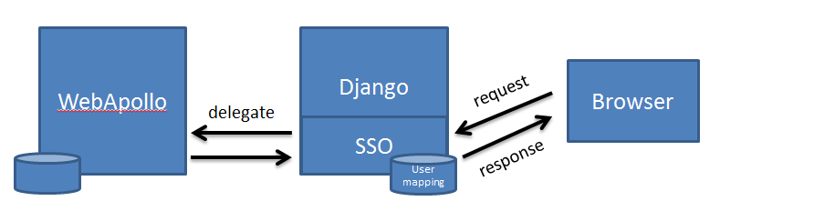
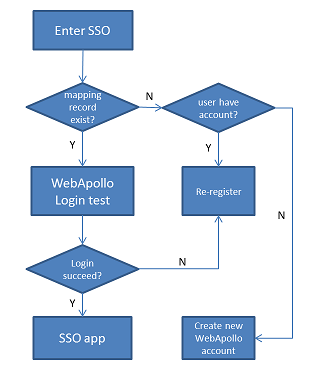

WebApollo Single Sign On
========================
What is WebApollo SSO?
-----------------------
The basic idea in SSO is to provide handy user interface and make WebApollo user more like a community. In order to accomplish those ideas, we try to transfer management jobs from WebApollo to SSO. SSO gives the coordinators more authority to manage their members who can annotating and grant the priviledges on their own.

In SSO, we seperate users into three different roles. 

* First, the ``ADMIN`` who actually owns 'admin priviledge' in WebApollo, can manage users/groups/eroll event.
* Second, the ``COORDINATOR`` who belong to group ``GROUP_(Organism_short_name(OSN))_ADMIN``, can manage membership in specific (Organism). 
* Last, the remaining users are in ``USER``. They can make request to join (or leave) different organism team. Once be recuited in, user will pertain to group ``GROUP_(OSN)_USER``. 

SSO make a virtual role ``COORDINATOR`` by exploiting a conventional group name ``GROUP_(OSN)_ADMIN`` and the user in the team 
would be in group ``GROUP_(OSN)_USER``.

+--------------+------------------+--------------------------------------------+
| Role\\       | WebApollo        | Single Sign On (SSO)                       | 
+--------------+------------------+--------------------------------------------+
| ADMIN        | Global Admin     | Global Admin                               | 
+--------------+------------------+--------------------------------------------+
| COORDINATOR  | Admin permission | in GROUP_()_ADMIN                          | 
+--------------+------------------+--------------------------------------------+
| USER         | RWE permission   | in GROUP_()_USER with RWE permission       | 
+--------------+------------------+--------------------------------------------+

.. note:: Mapping between full organism name and short organism name are stored in django-blast app. Full organism name is the real name in WebApollo and short name is a abbreviation used in django-blast app.

Framework Overview 
------------------

SSO was implemented in Django and JQuery. Conceptually, SSO is a proxy service for delegating user request to appropriate WebApollo service. 
The main advantage here is that SSO could provides more social utilities for the I5K community.

**Database Schema (UserMapping)**

+-----------------+------------------+---------------------+--------------+-------------+
| Apollo_user_id  | Apollo_user_name | Apollo_user_pwd     | django_user  | last_date   |
+-----------------+------------------+---------------------+--------------+-------------+
| 1               | Chris            | (AES encrpted pwd)  | Christopher  |             |
+-----------------+------------------+---------------------+--------------+-------------+
| 2               | Monica           | (AES encrpted pwd)  | Monica       |             |
+-----------------+------------------+---------------------+--------------+-------------+
| 3               | Mei              | (AES encrpted pwd)  | NULL         |             |
+-----------------+------------------+---------------------+--------------+-------------+

SSO records the mapping between Apollo_user and django_user in table ``UserMapping``. 
``Apollo_user_id`` and ``django_user`` are unique attribute and this makes mapping a one to one relationship. 
(apollo_user_name could be changed and is not unique)

In above table, record 1 and 2 tell a formal relationship but record 3 describes an Apollo user doesn't belong to any django user. 
User can claim it by re-register process. (mentioned below)

Configuration 
-------------
SSO uses a pre-assigned admin Apollo account to communiate with Apollo server. The account must be 
create on apollo server first. Two URLs address of i5k server and apollo server are used to identify 
each others' locations. In order to secure user password, SSO encrpt it before saving password into database.

WebApollo SSO configuration in django setting.py::

   # WebApollo SSO robot account
   ROBOT_ID='R2D2'
   ROBOT_PWD='demo'

   #URL of i5k workspace and webapollo
   I5K_URL='http://i5k.nal.gov'
   APOLLO_URL='http://i5k.apollo.nal.gov/apollo'

   # cookie can be seen in Apollo-prod and Gmod-prod
   APOLLO_COOKIE_DOMAIN=".nal.usda.gov"

   #Encypt webapollo user password in SSO database.
   #AES key must be either 16, 24, or 32 bytes long.
   SSO_CIPHER='1234567890123456'

Register WebApollo
------------------
There are three ways to make connection between i5k account to apollo account.

* When registering an new i5k account, SSO also create an apollo account(same ID).
* When entering SSO, if SSO doesn't have mapping record of user,

    * it asks user to create a new apollo account 
    * or register his account info into SSO. 

* When entering SSO, if SSO has mapping record of user but login failed, it asks user to re-enter his password into SSO.

Utilities
---------
There are six individual tab pages, three of them are general and others are specific for Admin user.

Utilities only for Admin
~~~~~~~~~~~~~~~~~~~~~~~~

+-----------------+-------------------------------------------------------+
| Tab\\           | Function Descriptions                                 |
+-----------------+-------------------------------------------------------+
| User(Admin)     | View/Create/Delete/Update/Disconnect Apollo User      |
+-----------------+-------------------------------------------------------+
| Group(Admin)    | View/Create/Delete Apollo Group                       |
+-----------------+-------------------------------------------------------+
| PReq(Admin)     | View Pending request                                  |
+-----------------+-------------------------------------------------------+

General Utilities
~~~~~~~~~~~~~~~~~

+-----------------+-------------------------------------------------------+
| Tab\\           | Function Descriptions                                 |
+-----------------+-------------------------------------------------------+
| My Organism     | Manage organism which you joined in / Go WebApollo    |
+-----------------+-------------------------------------------------------+
| My Request      | Make request to join/leave a organism community       |
+-----------------+-------------------------------------------------------+
| My Info         | User basic information                                |
+-----------------+-------------------------------------------------------+

